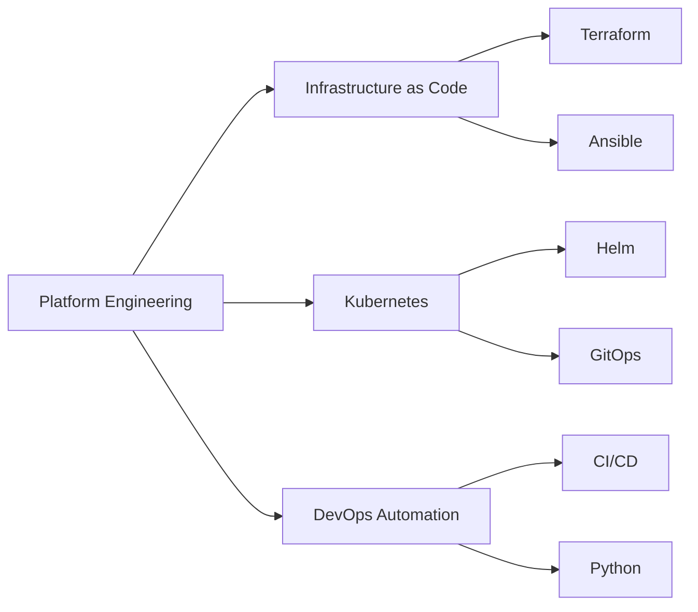

# 🛡️ Platform Engineer | Infrastructure Architect

## 👋 About Me

Platform Engineer specializing in infrastructure automation, cloud architectures, and developer experience optimization. Transitioning from network engineering to cloud-native technologies with a focus on building scalable, secure platforms.

## 🚀 Current Focus

## 💼 Professional Experience

### Core Competencies
- **Infrastructure as Code**: Terraform, Ansible, CloudFormation
- **Container Orchestration**: Kubernetes, Docker, Helm
- **Cloud Platforms**: AWS, Azure, GCP
- **Network Automation**: Cisco ISE, Python, REST APIs
- **Security**: Zero Trust, PKI, Compliance Automation
- **Observability**: Prometheus, Grafana, ELK Stack

### Technical Stack

| Category | Technologies |
|----------|-------------|
| **Languages** | Python, Go, Bash, JavaScript/TypeScript |
| **IaC** | Terraform, Ansible, Pulumi |
| **Containers** | Docker, Kubernetes, OpenShift |
| **CI/CD** | GitHub Actions, GitLab CI, Jenkins |
| **Cloud** | AWS, Azure, GCP |
| **Monitoring** | Prometheus, Grafana, Datadog |

## 📊 GitHub Stats

  

## 🔧 Featured Projects

### [Platform Tools](https://github.com/EvanusModestus/platform-tools)
Production-ready automation utilities for infrastructure management
- Cloud resource tagging automation
- SSL certificate monitoring
- Terraform modules for enterprise deployments

### [Dotfiles](https://github.com/EvanusModestus/dotfiles)
Comprehensive Linux environment configuration
- Neovim power-user setup
- Development environment automation
- Cross-distribution compatibility

### [Technical Blog](https://github.com/EvanusModestus/tech-blog)
Technical articles and tutorials on platform engineering
- Infrastructure as Code best practices
- Cloud architecture patterns
- DevOps transformation guides

## 📚 Recent Blog Posts

- 🏗️ **Building Production-Ready Kubernetes Platforms**
- 🔄 **From Network Engineer to Platform Engineer: A Transition Guide**
- 🔧 **Automating Cisco ISE with Python**
- 🚀 **GitOps: The Path to Declarative Infrastructure**
- 🔒 **Implementing Zero Trust Architecture in the Cloud**

## 🎯 2025 Goals

- [ ] Complete CKA (Certified Kubernetes Administrator)
- [ ] Contribute to 5 open-source projects
- [ ] Publish 52 technical articles
- [ ] Build enterprise-grade platform tools
- [ ] Master Go for cloud-native development

## 🤝 Let's Connect

- 💼 **LinkedIn**: [/in/evanusmodestus](https://linkedin.com/in/evanusmodestus)
- 📝 **Blog**: [blog.evanusmodestus.dev](https://blog.evanusmodestus.dev)
- 📧 **Email**: platform@evanusmodestus.dev
- 🐦 **Twitter**: [@evanusmodestus](https://twitter.com/evanusmodestus)

## 💡 Philosophy

> "Infrastructure should be invisible to developers, yet powerful enough to scale their ambitions."

---

### 🏗️ Building Platforms That Scale

**Automate** • **Secure** • **Scale** • **Innovate**

