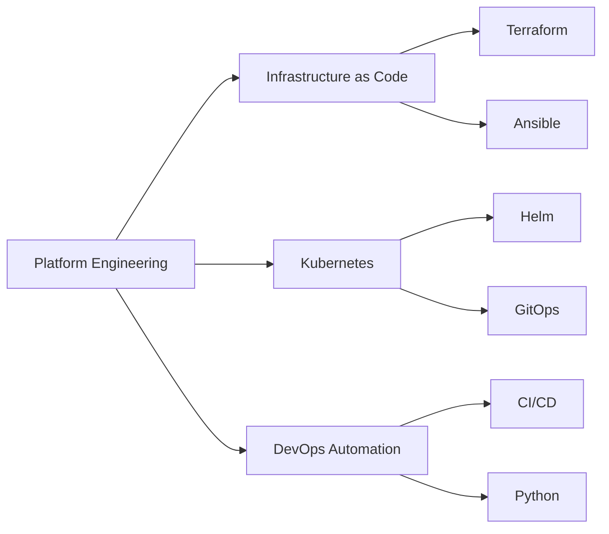

# 🔐 Network/InfoSec Engineer | Aspiring Platform Engineer

## 👋 About Me

Network/InfoSec Engineer with deep expertise in Cisco ISE/802.1X, routing/switching, and enterprise security. Passionate about platform engineering, full-stack development, and building elegant knowledge management systems. Currently transitioning toward cloud-native technologies while maintaining strong foundations in network security.

## 🚀 Current Focus

## 💼 Professional Experience

### Core Competencies
- **Network Engineering**: Cisco ISE/802.1X, Routing & Switching, Network Automation
- **Security**: Zero Trust, PKI, NAC, Compliance Automation
- **Infrastructure as Code**: Terraform, Ansible, Python
- **Full-Stack Development**: JavaScript/TypeScript, React, Node.js
- **Knowledge Management**: Obsidian, Markdown, PKM Systems
- **Cloud Platforms**: AWS, Azure (Learning)

### Technical Stack

| Category | Technologies |
|----------|-------------|
| **Languages** | Python, Go, Bash, JavaScript/TypeScript |
| **IaC** | Terraform, Ansible, Pulumi |
| **Containers** | Docker, Kubernetes, OpenShift |
| **CI/CD** | GitHub Actions, GitLab CI, Jenkins |
| **Cloud** | AWS, Azure, GCP |
| **Monitoring** | Prometheus, Grafana, Datadog |

## 📊 GitHub Stats

  

## 🔧 Featured Projects

### [Domus Digitalis](https://domusdigitalis.dev) *(Coming Soon)*
Full-stack web application showcasing portfolio and services
- Modern design with responsive UI
- Built with cutting-edge web technologies
- Professional portfolio and blog platform

### [Knowledge Management System](https://github.com/EvanusModestus/Aethelred-Codex)
Sophisticated PKM built with Obsidian and Markdown
- Advanced linking and tagging system
- Custom workflows for knowledge capture
- Integration with development tools

### [Platform Tools](https://github.com/EvanusModestus/platform-tools)
Network and infrastructure automation utilities
- Cisco ISE automation scripts
- Network compliance checking
- Security audit tools

### [Dotfiles](https://github.com/EvanusModestus/dotfiles)
Comprehensive Linux environment configuration
- Neovim power-user setup
- Development environment automation
- Cross-distribution compatibility

## 📚 Recent Blog Posts

- 🔒 **Automating Cisco ISE with Python and REST APIs**
- 🔄 **From Network Engineer to Platform Engineer: My Journey**
- 🌐 **802.1X Deep Dive: Enterprise NAC Implementation**
- 🧠 **Building a Second Brain with Obsidian**
- 🚀 **Full-Stack Development for Network Engineers**

## 🎯 2025 Goals

- [ ] Complete CKA (Certified Kubernetes Administrator)
- [ ] Contribute to 5 open-source projects
- [ ] Publish 52 technical articles
- [ ] Build enterprise-grade platform tools
- [ ] Master Go for cloud-native development

## 🤝 Let's Connect

- 💼 **LinkedIn**: [/in/evanjrosado](https://www.linkedin.com/in/evanjrosado/)
- 📝 **Blog**: [blog.evanusmodestus.dev](https://blog.evanusmodestus.dev)
- 🌐 **Portfolio**: [domusdigitalis.dev](https://domusdigitalis.dev) *(Coming Soon)*
- 📧 **Email**: evan.rosado@outlook.com
- 🐦 **X (Twitter)**: [@evanusmodestus](https://x.com/evanusmodestus)

## 💡 Philosophy

> "The network is the foundation; automation is the evolution; knowledge is the revolution."

---

### 🔐 Network Security | 🚀 Platform Engineering | 💡 Knowledge Systems

**Connect** • **Automate** • **Secure** • **Innovate**

